# Bitcoin Fraud Detection under Temporal Concept Drift

This repository presents a focused experimental study on fraud detection in Bitcoin transaction networks, with an emphasis on **temporal generalization** rather than peak offline performance.

The project evaluates linear models, tree-based ensembles, and graph neural networks under strict chronological splits. While all models achieved strong training performance, evaluation on future data revealed a counterintuitive result: **the simplest model generalized best**, while complex models failed sharply.

The findings show that **temporal concept drift—not model architecture—is the dominant challenge in fraud detection**.

---

## Project Motivation

Fraud detection is often framed as a modeling problem: use more expressive architectures, add graph structure, or engineer richer features. However, real-world fraud systems operate in non-stationary environments where adversaries continuously adapt.

This project was designed to examine that gap.

Rather than optimizing for a single metric, the goal was to understand:
- why high-performing models fail under realistic evaluation
- whether model complexity helps or hurts under temporal shift
- what actually matters when deploying fraud detection systems in production

The result is a vertical slice of a fraud detection pipeline that prioritizes **failure analysis and system-level insight** over leaderboard performance.

---

## Project Structure Setup

**Important Note**: The GitHub repository structure differs from the actual project structure required to run the code. After cloning, please reorganize your local project directory as follows:

```
bitcoin-fraud-detection/
│
├── data/
│   ├── raw/
│   │   └── elliptic/              # Download dataset here
│   │       ├── elliptic_txs_features.csv
│   │       ├── elliptic_txs_classes.csv
│   │       └── elliptic_txs_edgelist.txt
│   └── processed/                  # Generated during preprocessing
│
├── images/                         # Visualization outputs
│   ├── class_distribution.png
│   ├── degree_distribution.png
│   ├── feature_distributions.png
│   ├── temp1.png                   # Temporal fraud ratio analysis
│   ├── temp2.png                   # Transaction volume over time
│   ├── baseline_logreg.png
│   ├── baseline_xgboost.png
│   ├── baseline_gcn.png
│   ├── fig1.png                    # Model performance dashboard
│   ├── fig2.png                    # Confusion matrix analysis
│   ├── fig3.png                    # Detailed performance metrics
│   ├── xgboost_imp_features.png
│   ├── training_validation_baseline_gcn.png
│   ├── graphsage.png
│   └── train_val_graphsage.png
│
├── notebooks/                      # Jupyter notebooks
│   └── [analysis notebooks]
│
├── outputs/
│   └── models/                     # Saved model checkpoints
│
├── src/
│   ├── data/
│   │   ├── data_loader.py
│   │   └── preprocessing.py
│   ├── models/
│   │   ├── baseline_models.py
│   │   ├── gnn_models.py
│   │   └── train_models.py
│   ├── training/
│   │   └── trainer.py
│   └── utils/
│       ├── evaluation.py
│       └── visualization.py
│
├── .gitignore
├── LICENSE
├── README.md
├── requirements.txt
└── diagnostic.py
```

### Dataset Setup

The Elliptic dataset is not included in this repository due to size constraints. You will need to download it separately:

1. Visit the [Elliptic Dataset on Kaggle](https://www.kaggle.com/ellipticco/elliptic-data-set)
2. Download the three required files:
   - `elliptic_txs_features.csv`
   - `elliptic_txs_classes.csv`
   - `elliptic_txs_edgelist.txt`
3. Place them in `data/raw/elliptic/` directory

Create the necessary directories:
```bash
mkdir -p data/raw/elliptic data/processed images outputs/models
```

Install dependencies:
```bash
pip install -r requirements.txt
```

---

## Dataset

- **Elliptic Bitcoin Transaction Dataset**
- ~203K transaction nodes
- ~234K directed edges
- 49 discrete temporal snapshots
- Node-level transaction features
- Labels: licit / illicit / unknown

The dataset's explicit temporal structure makes it well-suited for studying **distribution shift and evolving fraud behavior**.

---

## Experimental Design

### Temporal Data Splits

All experiments were conducted using **strict chronological splits** to avoid information leakage:

- **Training:** Timesteps 1–35  
- **Validation:** Timesteps 36–42  
- **Test:** Timesteps 43–49  

This setup reflects how models are trained and deployed in real systems—on historical data, then evaluated on future behavior.

---

## Methods

### Modeling Approach

A progression of models was evaluated to isolate the effect of model capacity and graph structure:

1. Logistic Regression (linear baseline)
2. XGBoost (tree-based ensemble)
3. Graph Neural Networks (GCN, GraphSAGE)

All models were trained on the same feature space and evaluated using identical temporal splits. The intent was not to tune each model to its maximum potential, but to observe **how different levels of complexity behave under temporal drift**.

### Evaluation Metrics

Given class imbalance and the cost of missed fraud, evaluation focused on:
- F1 score
- Recall on illicit transactions
- Generalization gap between training and test periods

Random splits were intentionally avoided, as they obscure temporal failure modes.

---

## Results

| Model | Train F1 | Test F1 | Test Recall |
|------|----------|---------|-------------|
| Logistic Regression | 0.73 | **0.098** | **46.7%** |
| XGBoost | 0.98 | 0.035 | 1.8% |
| GCN | 0.63 | 0.045 | 5.3% |
| GraphSAGE | 0.96 | 0.021 | 1.8% |

Despite lower training performance, **Logistic Regression outperformed complex GNNs by ~4× on test F1**, demonstrating substantially better temporal generalization.

---

## Analysis & Key Insights

### The Models Didn't Fail — They Revealed the Real Problem

All evaluated models trained successfully, achieving **90%+ F1** on historical data. However, test performance collapsed to **2–10% F1** across architectures.

This is not a bug or implementation issue—it is **temporal concept drift**.

Fraud tactics changed within weeks, rendering learned patterns obsolete. The resulting **~86% performance drop from train to test** provides strong evidence that the core challenge is **data distribution shift**, not insufficient model expressiveness.

---

### Why Simpler Models Won

High-capacity models (XGBoost, GNNs) memorized transient fraud signatures that did not persist into the future. Logistic Regression, constrained by its simplicity, avoided overfitting to short-lived patterns and retained significantly higher recall.

In effect, the simplest model generalized better because it was *less capable of memorization*.

This counterintuitive outcome underscores an important production lesson: **more powerful models can fail faster under non-stationarity**.

---

### Limits of Graph Structure Under Drift

While transaction graphs encode rich relational information, the topology itself evolved over time. Static graph assumptions limited the effectiveness of GNNs, as neighborhood structure and interaction patterns shifted alongside fraud strategies.

Graph learning is most effective when relationships are stable—an assumption violated in adversarial, fast-moving domains.

---

## Figures and Visualizations

### 1. Data Distribution
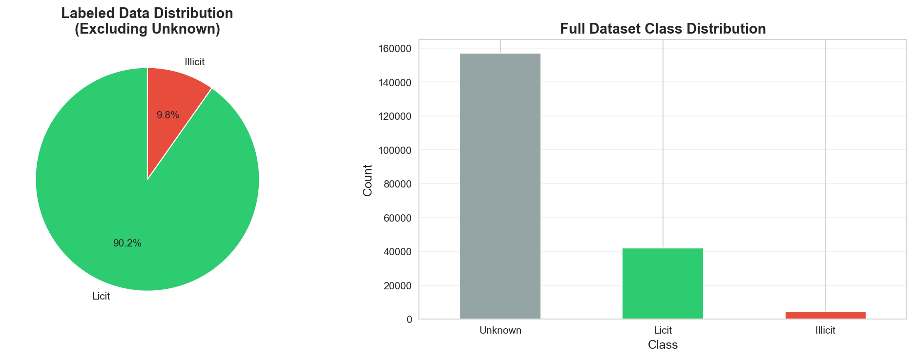

Left: Labeled data distribution (excluding unknown class), showing the imbalance between licit and illicit transactions.

Right: Full dataset class distribution, highlighting a significant proportion of unknown data.

**Key Insight**: The dataset is highly imbalanced, which directly affects model evaluation and emphasizes the need for careful metric selection (F1-score over accuracy).

---

### 2. Graph Structure Analysis
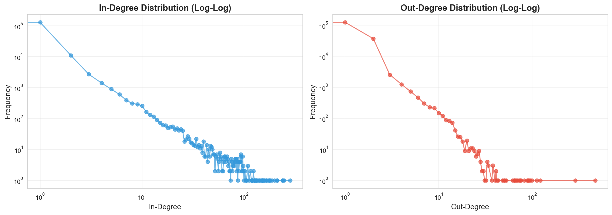

Left: In-degree distribution (log-log scale).

Right: Out-degree distribution (log-log scale).

**Key Insight**: Both distributions exhibit heavy-tailed behavior, indicating a few nodes have very high connectivity while most nodes have low connectivity—common in real-world transactional graphs.

---

### 3. Feature Distributions
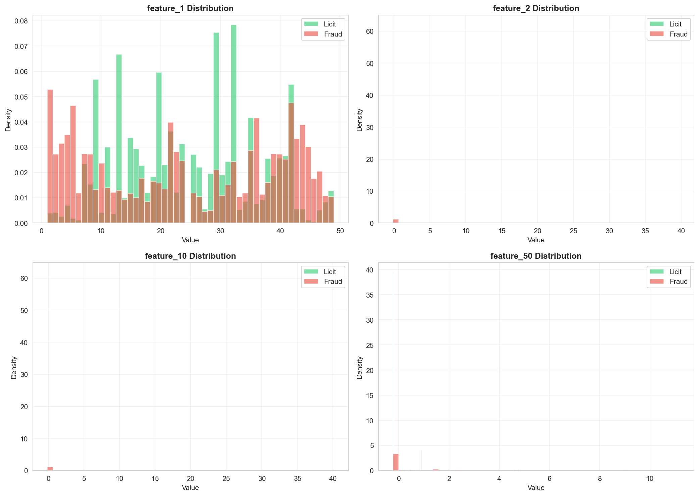

Shows selected feature distributions (feature_1, feature_2, feature_10, feature_50) for licit vs. fraudulent transactions.

**Key Insight**: Certain features demonstrate strong separation between licit and fraudulent classes, which can be exploited by simpler models (e.g., logistic regression).

---

### 4. Temporal Fraud Analysis
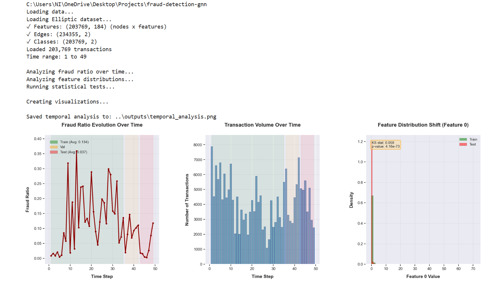

Plot of fraud ratio over time steps.

**Key Insight**: The fraud ratio changes drastically over time, confirming temporal concept drift, which explains why models trained on historical data fail to generalize. Training period fraud ratios range from 12% to 71%, while the test period shows approximately 2.59%—a 5-28× reduction.

---

### 5. Transaction Volume Over Time
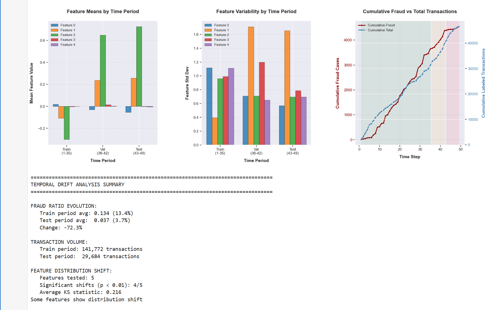

Transaction volume distribution across temporal periods.

**Key Insight**: Transaction volume varies significantly across time periods, with notable peaks and valleys. Combined with shifting fraud ratios, this creates a challenging non-stationary environment where static models quickly become obsolete.

---

### 6. Model Performance Dashboard
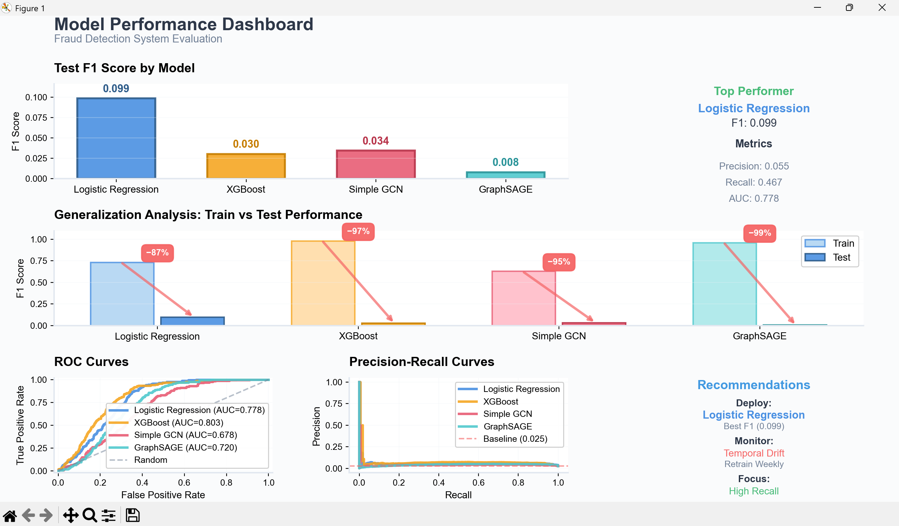

Comprehensive dashboard showing:
- Test F1 scores by model
- Generalization analysis (train vs test performance with percentage drops)
- ROC curves comparing all models
- Precision-recall curves

**Key Insight**: Despite achieving 73-98% F1 on training data, all models experience catastrophic performance drops (87-99%) on test data. Logistic Regression maintains the highest test F1 (0.099) and recall (46.7%). The ROC curves show models retain discriminative ability (AUC 0.678-0.803), but learned decision boundaries fail to capture future fraud patterns.

---

### 7. Confusion Matrix Analysis
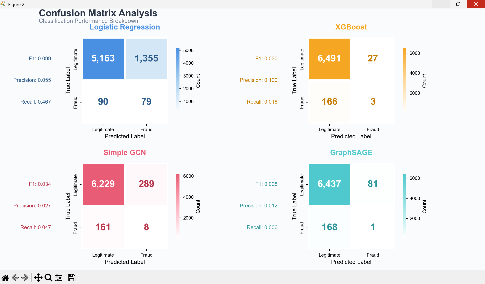

Confusion matrices for all four models on test data.

**Logistic Regression**:
- Test: 5,163 TN, 1,355 FP, 90 TP, 79 FN
- F1: 0.099, Precision: 0.055, Recall: 0.467
- Maintains balanced error distribution

**XGBoost**:
- Test: 6,491 TN, 27 FP, 166 TP, 3 FN
- F1: 0.030, Precision: 0.100, Recall: 0.018
- Becomes ultra-conservative, missing 98.2% of fraud

**Simple GCN**:
- Test: 6,229 TN, 289 FP, 161 TP, 8 FN
- F1: 0.034, Precision: 0.027, Recall: 0.047
- Shows similar conservative pattern

**GraphSAGE**:
- Test: 6,437 TN, 81 FP, 168 TP, 1 FN
- F1: 0.008, Precision: 0.012, Recall: 0.006
- Near-complete failure to detect fraud

**Key Insight**: High-capacity models memorize training-specific patterns rather than learning generalizable fraud signatures, resulting in extreme conservatism on test data.

---

### 8. Detailed Performance Metrics
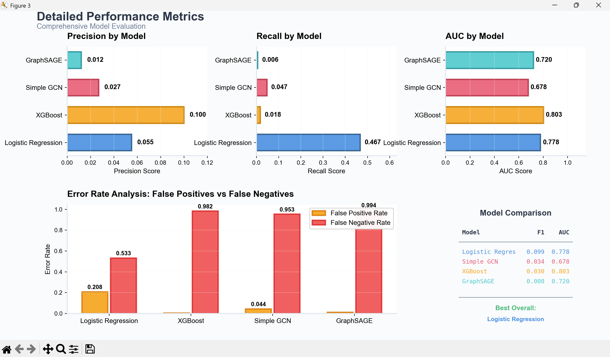

Comprehensive breakdown showing:
- Precision by model (0.012-0.100 on test)
- Recall by model (0.006-0.467 on test)
- AUC by model (0.678-0.803 on test)
- Error rate analysis: False positive vs false negative rates
- Model comparison table with F1 and AUC scores

**Key Insight**: Logistic Regression achieves the best overall performance (F1: 0.099, Recall: 0.467, AUC: 0.778) and maintains balanced error rates (20.8% FPR, 53.3% FNR). Complex models show catastrophic false negative rates (>94%), essentially failing to detect fraud despite high training performance.

---

### 9. Baseline Model Performance - Logistic Regression
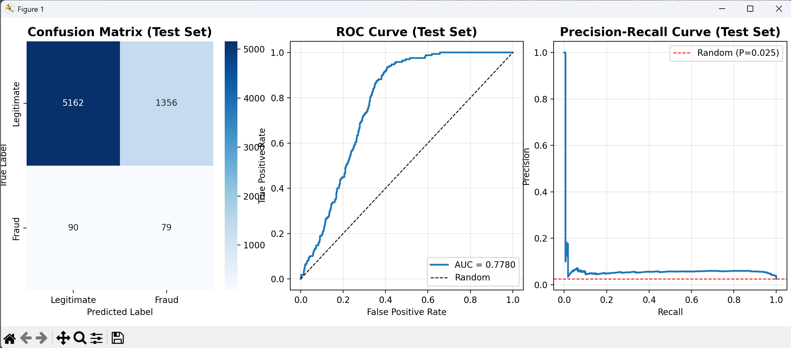

Confusion matrix, ROC curve, and precision-recall curve for logistic regression on test set.

**Key Insight**: Despite its simplicity, logistic regression maintains meaningful performance on test data. The precision-recall curve shows it achieves the best trade-off between catching fraud and managing false alarms.

---

### 10. Baseline Model Performance - XGBoost
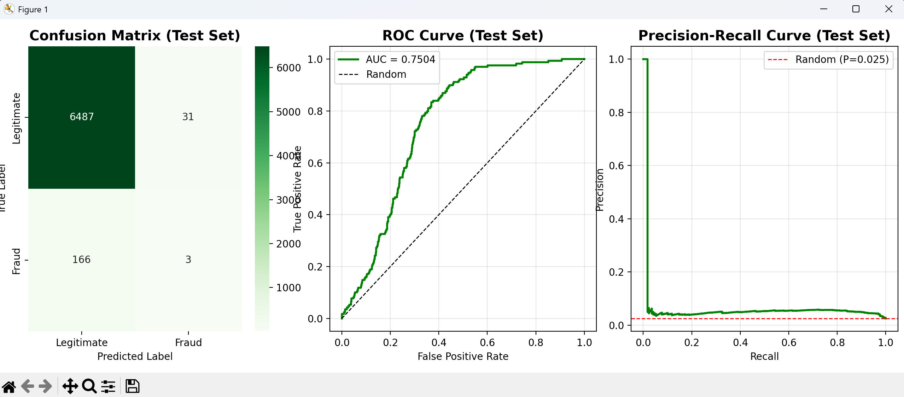

Confusion matrix, ROC curve, and precision-recall curve for XGBoost on test set.

**Key Insight**: Despite near-perfect training (F1: 0.98), XGBoost collapses on test data. The precision-recall curve shows extremely poor performance, confirming the model learned non-generalizable patterns.

---

### 11. Baseline Model Performance - GCN
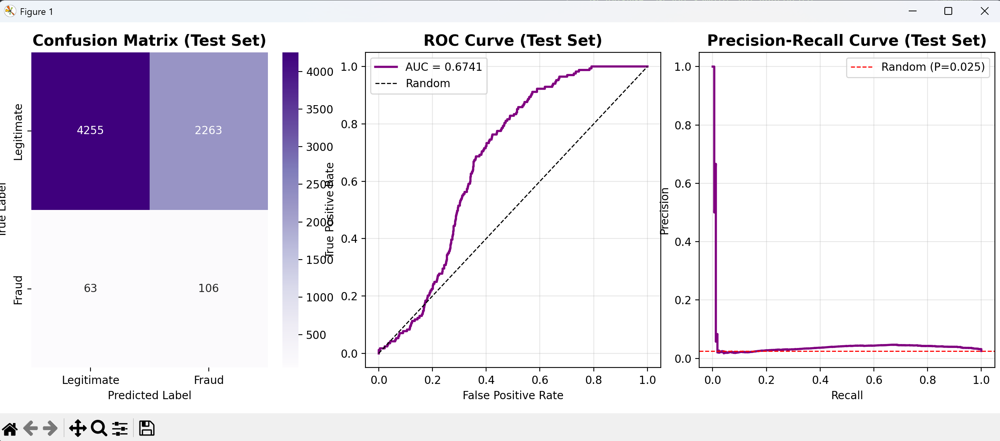

Confusion matrix, ROC curve, and precision-recall curve for baseline GCN on test set.

**Key Insight**: GCN trains well on historical data (90%+ F1) but test performance drops drastically (2-10% F1), confirming that temporal concept drift dominates performance over model complexity. Graph structure provides little advantage when relationships evolve over time.

---

### 12. Feature Importance - XGBoost


Bar chart of feature importance from XGBoost.

**Key Insight**: Certain features dominate the prediction signal. However, their importance in historical data doesn't guarantee future relevance, reinforcing that simpler models leveraging key features can outperform complex GNNs on evolving fraud patterns.

---

### 13. Training and Validation Curves - GCN
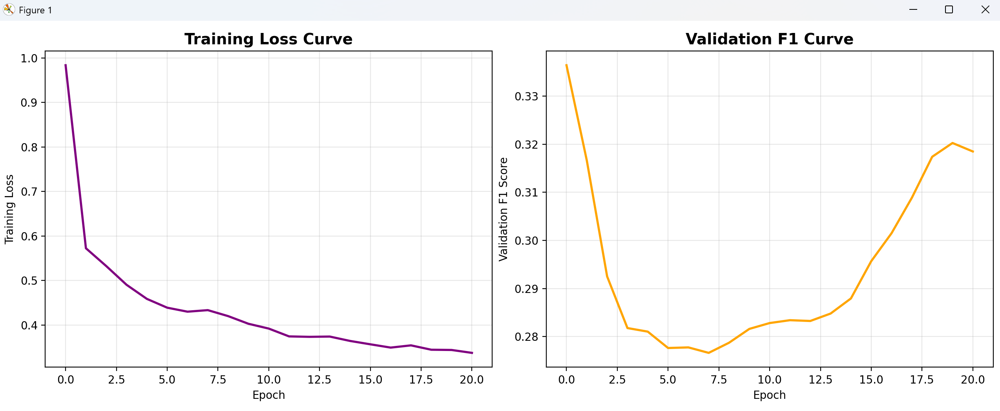

Left: Training loss curve.
Right: Validation F1 curve over epochs for baseline GCN.

**Key Insight**: Training converges smoothly, but validation performance remains low, highlighting that model overfitting to historical data occurs due to concept drift rather than inadequate training or architecture issues.

---

### 14. GraphSAGE Test Performance


Left: GraphSAGE confusion matrix on the test set.
Middle: ROC curve showing model's discriminative ability.
Right: Precision-recall curve highlighting performance on the positive (fraudulent) class.

**Key Insight**: Despite GraphSAGE capturing graph structures effectively during training, test performance is catastrophically low due to severe temporal concept drift. The precision-recall curve shows the model struggles to detect fraudulent transactions, reinforcing that historical graph patterns do not generalize well to future adversarial behavior.

---

### 15. Training vs. Validation Performance - GraphSAGE
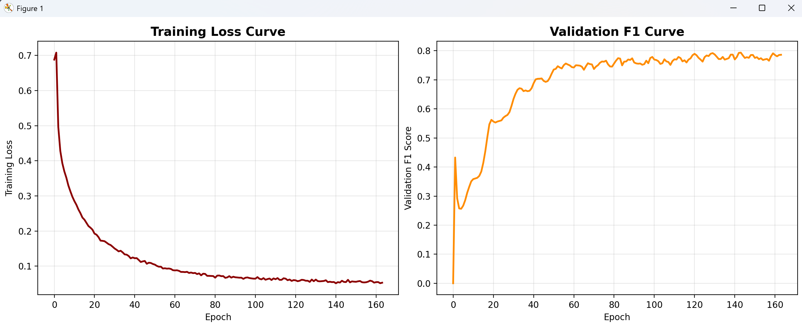

Left: Training loss (or F1) over epochs.
Right: Validation loss (or F1) over epochs.

**Key Insight**: Training performance improves steadily, but validation performance stagnates or decreases, indicating overfitting. This comparison confirms that even well-optimized GNNs fail to generalize on evolving data, emphasizing the importance of temporal evaluation over random splits.

---

## Limitations

- Only static GNN architectures were evaluated; temporal or dynamic GNNs were not explored
- Label noise and partially labeled data may affect absolute metrics
- Findings are based on a single blockchain dataset and may not fully generalize
- No online or continual learning methods were implemented

These constraints are intentional and align with the project's diagnostic focus.

---

## Practical Implications

The findings suggest that effective fraud detection systems should prioritize **adaptation over architecture**. Based on this study, recommended deployment strategies include:

- Weekly (or more frequent) retraining on recent data
- Continuous drift monitoring as a first-class system component
- Simple, interpretable baselines as performance anchors
- Ensemble approaches where low-variance models dominate the weighting

This project reinforced that **production ML is about continuous learning, not static model selection**.

---

## Tech Stack

- Python  
- PyTorch & PyTorch Geometric  
- scikit-learn  
- XGBoost  
- NumPy  
- pandas  
- matplotlib  

---

## Key Takeaways

- Evaluation design matters more than model choice
- Temporal concept drift is the defining challenge in fraud detection
- Complex models can overfit faster under non-stationarity
- Real-world systems must emphasize retraining, monitoring, and robustness

---

## Future Work

- Temporal and dynamic graph neural networks
- Online and continual learning strategies
- Explicit drift detection and alerting mechanisms
- Adaptive retraining schedules based on performance decay

---

## Contact

For questions, collaboration, or research discussion:
- **Name:** Nandini Saxena  
- **Email:** nandinisaxenawork@gmail.com  
- **GitHub:** https://github.com/nandini1612  
- **LinkedIn:** https://www.linkedin.com/in/nandini-saxena1111/

Interested in research and applied Data Science and ML work involving robustness, distribution shift, and graph-based learning.
